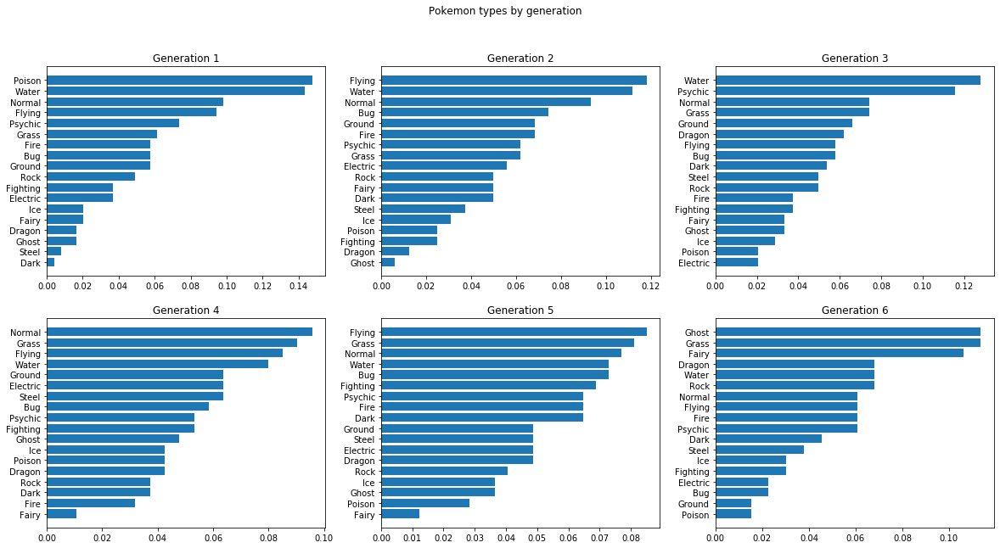

# Pokémon with Stats

I took this dataset from <a href="https://www.kaggle.com">Kaggle</a> to pratice data analysis and visualization with Python. 

The data for this table has been acquired from several different sites, including:

* <a href="https://www.pokemon.com/us/pokedex/">pokemon.com</a>
* <a href="https://pokemondb.net/pokedex">pokemondb</a>
* <a href="https://bulbapedia.bulbagarden.net/wiki/List_of_Pok%C3%A9mon_by_National_Pok%C3%A9dex_number">bulbapedia</a>

#### Files:
* `Pokemon.csv` - dataset from Kaggle
* `Pokemon_clean.csv` - my cleaned dataset
* `Pokemon_Stats.ipynb` - my Jupyter Notebook (data cleaning + analyses)

## Key Takeaways

### What is the distribution of stats?

All stats are skewed right, with the shape of total looking closest like a bell curve. This means that few Pokémon are known for excelling in a particular trait. A guess is that Pokémon with high totals could be legendaries.

There is a subtle pattern in the number of Pokémon introduced each generation. Even numbered generations tend to have fewer new Pokémon.

### What Pokemon types are most common in each generation?

* Flying, Water, and Normal are generally the types with higher proportions across generations
* Poison is the most common (14%) in Generation 1, but dropped towards the bottom (under 5%) in the following generations
* Fairy was introduced in Generation 4 (under 2%) but rose to over 10% (top 3 types) in Generation 6. Pokemon in  previous generations received the Fairy type retroactively
* Ghost rose to the majority type in Generation 6...maybe Generation 6 is known for being pretty obscure
