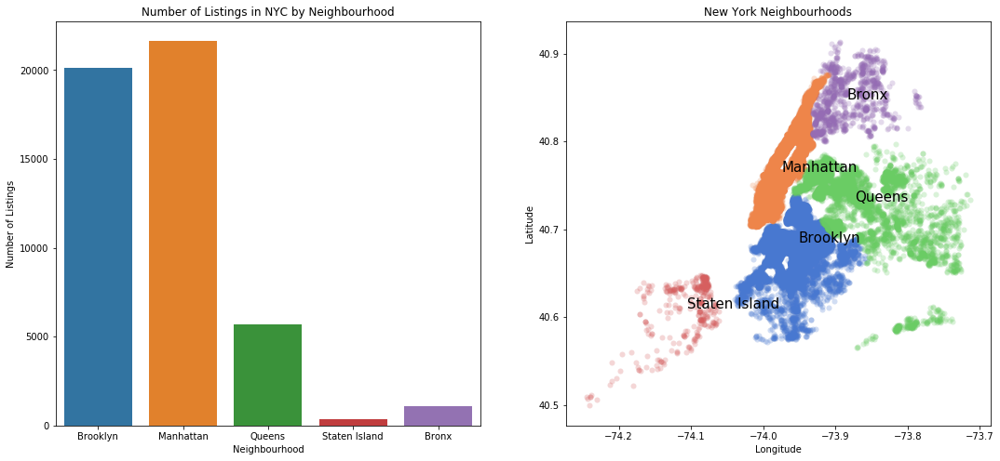
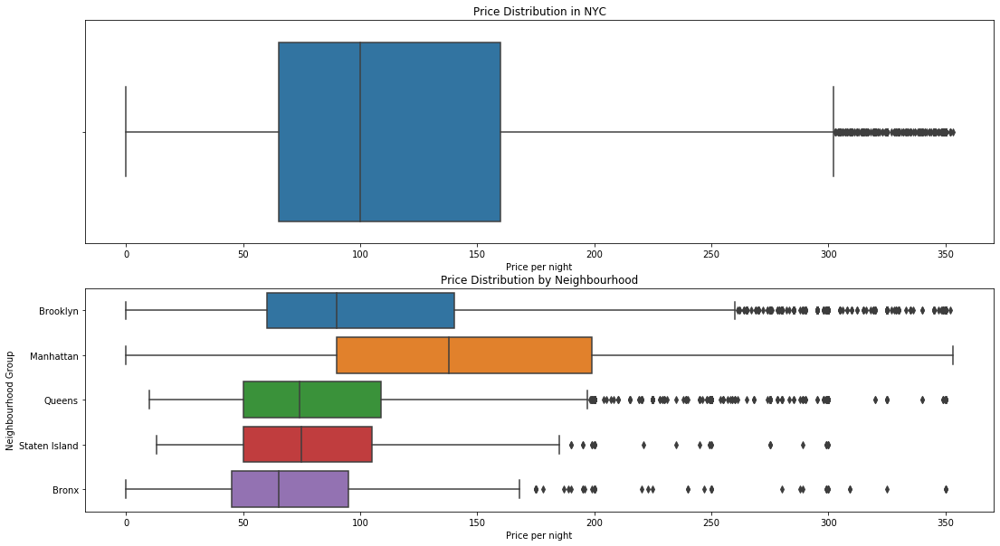
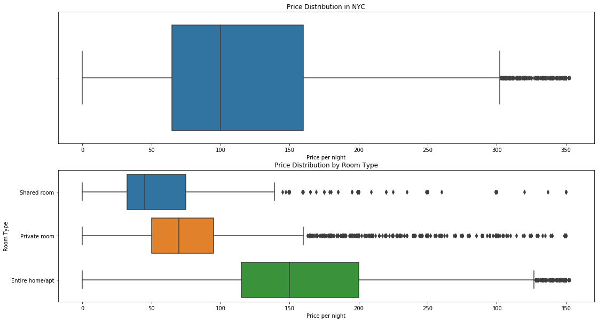
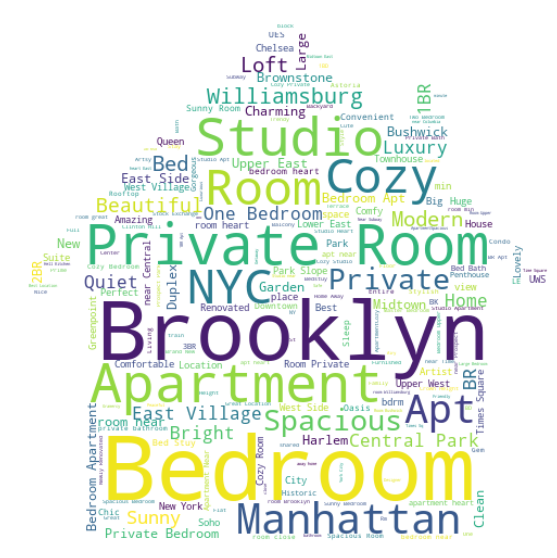

# AirBnB NYC Open Data

This dataset was taken from <a href="https://www.kaggle.com/dgomonov/new-york-city-airbnb-open-data/">kaggle</a>. It contains data on each listing, its neighborhood ("neighbourhood"), coordinates, room type, price, number of reviews, and availability. 

Since I recently visited Manhattan, NYC for the first time and stayed in a shared quad-bedroom (the cheapest type there is), I thought investigating the New York AirBnB landscape would be relevant. My assumptions and understandings during my visit will supplement this analysis.

## Key Takeaways

### Which neighbourhoods are the busiest?

Manhattan as the busiest neighbourhood group, followed by Brooklyn, Queens, Bronx, and Staten Island.

### Which neighbourhoods are the most expensive?

Obviously, Manhattan is the most expensive because it has the most tourist activity and companies. 

Within Manhattan, places south of Central Park are more expensive.

### What are the average prices per room type?

Overall, these prices are higher the the majority of AirBnB in other states. Shared rooms are the cheapest, followed by private rooms, then entire homes.

### What words tend to be used the most in listings?

Hosts tend to specify the room type, neighbourhood, and just the fact that it's a room. There are positive characteristics such as "Charming", "Spacious", "Garden", "Luxury", and "Comfy". 

After breaking the word cloud down by room type, there are subtle differences:
* Listings tend to have their room type in their name. All of them share the common word "cozy".
* Shared rooms have "couch", "living room", "loft", and gender ("girl", "male"). Private rooms say "private", "sunny", "beautiful", and "quiet. Entire homes say "spacious", "luxury", "garden", and "modern".
* Both shared rooms and private rooms have words describing proximity ("near", "close", "min"). Entire homes seem to focus more on quality and luxury.
