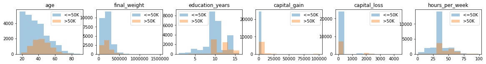

# Adult Census Income

This dataset was taken from the <a href="https://archive.ics.uci.edu/ml/datasets/Adult">UCI Machine Learning Repository</a>. The goal is to predict whether income exceeds \$50K/yr based on census data, but I used this mostly for data exploration. I plan on revisiting this dataset with more predictive analytics (tried a few in this notebook) later on.

The data was donated by Barry Becker in 1995 using the 1994 census database, so the information may not be as relevant now. However, I still think it's interesting to know education, salary, relationship, gender, and race over 20 years ago, and see how/if they have changed over time.

## Key Takeaways

### What is the salary category for each variable?

* **Age:** The distribution is skewed right. Most people under 35 make a <= 50K salary. People who make > 50K salary tend to be above 40.
* **Final Weight:** The distribution is skewed right. Most weights are under 250,000.
* **Education:** Most of the population has values of 9, 10, and 13 (HS-grad, some college, and Bachelors). The majority of people making >50K have at least 10 years of education.
* **Capital Gain:** Most don't have other sources of income. 
* **Capital Loss:** Most don't have other losses. 
* **Hours per Week:** The majority work 40 hours per week. Besides the spike at the 40 hour mark, the distribution looks most normal out of all the numerical variables. Those with >50K salary work at least 40 hours, not less.

### What are some initial conclusions from exploring the data?

* Workforce with >50K salary is mostly white, male, at least graduated from high school, work at least 40 hours per week, and are in a prof-specialty or exec-managerial position.
* Workforce with <=50K salary is likely the person is under 30 years old, female, did not graduate from college, works less than 40 hours per week, and was never married.