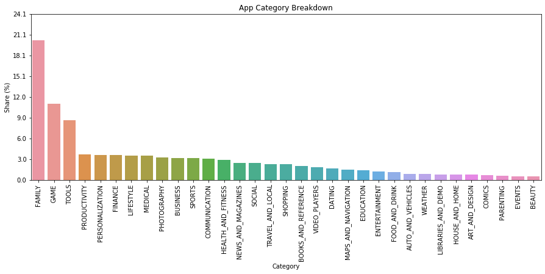
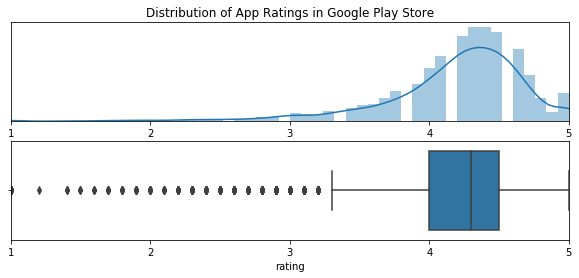
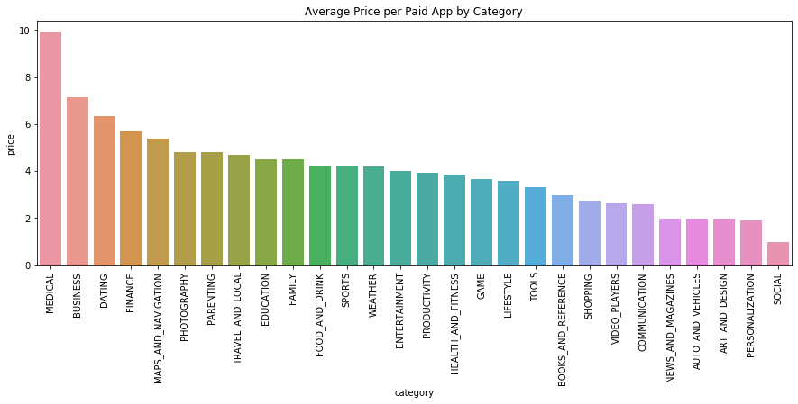

# Google Play Store Apps

This dataset was taken from <a href="https://www.kaggle.com/lava18/google-play-store-apps/">kaggle</a>. It contains data on apps, including rating, category, price, and installs.

I am an android user, so it would be interesting to see how I compare with the general population of android users who download from the Google Play Store. I rarely spend money on apps; and I have a few messaging, social media, and game apps. I'm curious if paid apps are worth it, since I don't have the best judgement or experience with them.

## Key Takeways

### What categories exist in the Google Play Store

**Family** is the largest category close to 20%. The second largest category is **Game** around 10%. The third largest category is **Tools** at 8%. Family and Game might be share the same apps if they are kid-oriented, which explains why they make up the majority. There are also a lot of mobile game companies developing games, whereas not as many developers create Weather apps or Dating apps.

The next few categories are under 5%. We have some solid/go-to apps like Google Maps, AirBnB, or Uber/Lyft, and those categories tend to have fewer options in their space.

### What is the average rating?

Most apps have a positive rating with the median at **4.3** and mean at **4.2**. The majority of apps have at least a 4-star rating, fewer have 3-star ratings. 

### How much do apps cost?

Medical apps are the most expensive averaging just under `$10`. Business, dating, and finance are the next most expensive even though there aren't as many apps out there.
