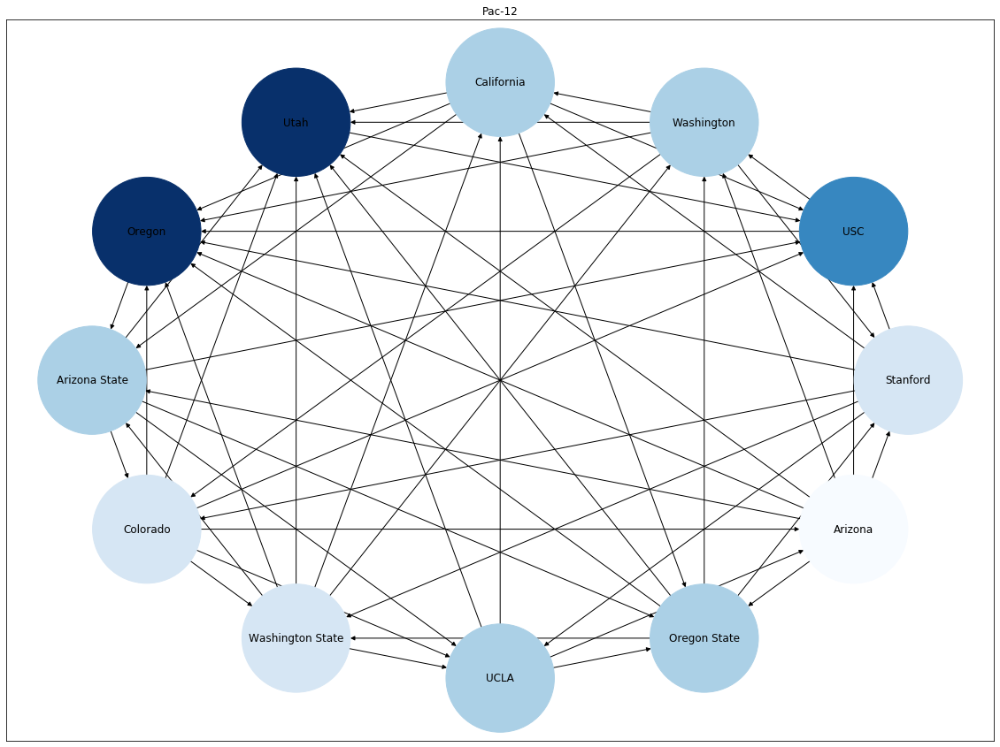
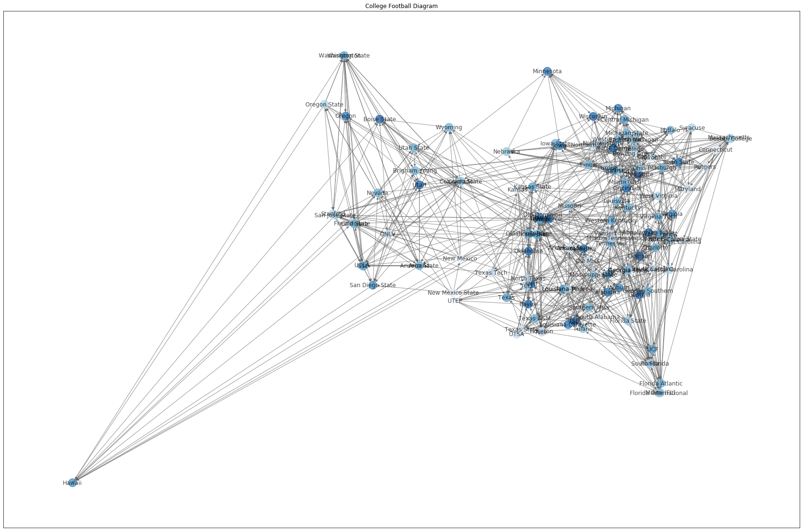

# College Football 2019

I can't escape the hype (from others) surrounding college football, so I decided to scrape <a href="https://www.ncaa.com/scoreboard/football/fbs/2019/01">NCAA's website</a> for weekly scores. With this data, I drew diagrams of how schools are connected to each other through game results. 

#### What I learned:

* Using *Beautiful Soup* to get team information and scores from HTML
* Using Google Map's *Geocoding API* to get longitude and latitude coordinates of schools
* Using *networkx* to visualize how schools perform

## Key Takeaways

### Does the Pac-12 complete the Circle of Suck?

Every team in the Pac-12 has lost to a team, which lost to a team that the losing team won against. Also, Oregon and Utah are really good.

### Which schools have played each other?

This is a messy visual on which school won/lost against which. The darker shade indicates higher wins, so The Ohio State and Lousiana are some few that are highly ranked due to majority wins. 
