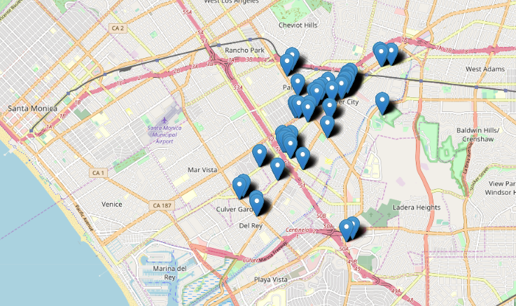

# Yelp in Culver City

I was exploring d3 (javascript) for data visualization and wanted to do a project based on where I work: Culver City! It's so nice walking downtown after work, so I'm sad we're relocating our office. This work was only to obtain and clean data on the local businesses, and I would visualize separately.  

#### What I learned:

* Using *Yelp Fusion API* to programatically get a list of local businesses in Culver City
* Manipulating data from a JSON
* Cleaning location information and plotting using *folium* library

