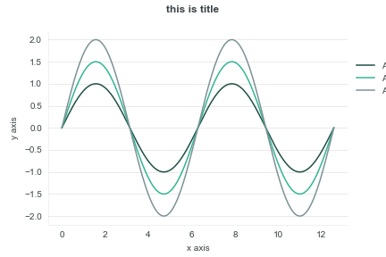
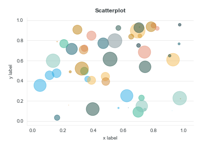
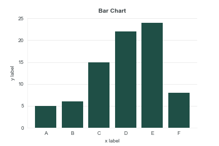

#  Matplotlib template

## Initial Set Up

Find your `matplotlib` configuration directory. The following code shows the directory location.

```
import matplotlib as mpl
mpl.get_configdir()
```

Create a subdirectory called `stylelib` if it doesn't already exist. Add `default.mplstyle` (or any other template here).

## How to Run

In Jupyter Notebook, import `matplotlib.pyplot` as `plt` and run the following code.

```
plt.style.use('default')
```

## Examples

Initial Setup

```
# Import packages
import matplotlib.pyplot as plt
import numpy as np
# Use our custom style
plt.style.use('default')
```

### Line Chart

```
fig = plt.figure()
fig.suptitle("this is title")
ax = fig.add_subplot(111)
x = np.linspace(0, 4*np.pi, 200)
y1 = np.sin(x)
y2 = 1.5*np.sin(x)
y3 = 2*np.sin(x)
ax.plot(x, y1, label='A = 1')
ax.plot(x, y2, label='A = 1.5')
ax.plot(x, y3, label='A = 2')
ax.set_xlabel('x axis')
ax.set_ylabel('y axis')
# Add legend - loc is a tuple specifying the bottom left corner
ax.legend(loc=(1.02, 0.65))
plt.show()
```


### Scatterplot

```
np.random.seed(19680801)
N = 50
x = np.random.rand(N)
y = np.random.rand(N)
colors = np.random.choice(plt.rcParams['axes.prop_cycle'].by_key()['color'], N)
area = (30 * np.random.rand(N))**2  # 0 to 15 point radii
plt.title("Scatterplot")
plt.xlabel("x label")
plt.ylabel("y label")
plt.scatter(x, y, s=area, c=colors, alpha=0.5)
plt.savefig("2.png")
plt.show()
```


### Bar Chart

```
x = ['A', 'B', 'C', 'D', 'E', 'F']
energy = [5, 6, 15, 22, 24, 8]
x_pos = [i for i, _ in enumerate(x)]
plt.bar(x_pos, energy)
plt.xlabel("x label")
plt.ylabel("y label")
plt.title("Bar Chart")
plt.xticks(x_pos, x)
plt.savefig("3.png")
plt.show()

```

